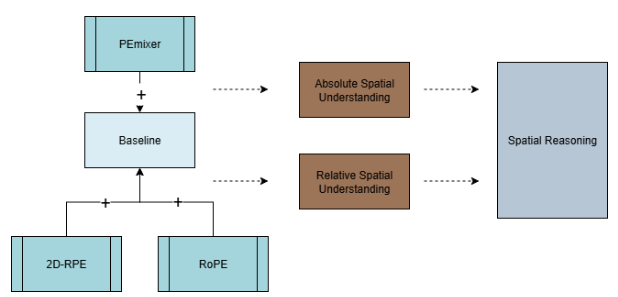
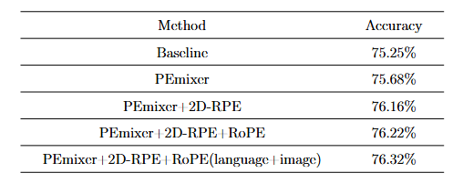
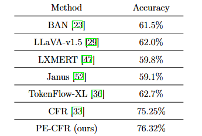

# Visual Question Answering with Vision-Language Model
This is the code repository for the Master's project: Visual Question Answering with Vision-Language Model  
The model is built upon the CFR_VQA <https://github.com/aioz-ai/CFR_VQA.git>, we further incorporate PEmixer, 2D-RPE and apply Rotary Embedding on both the language and visual encoders.  
We display the high-level overview of our model:  


Our ablation study result is shown below:  
 


We also compare our new model with other benchmarks on this dataset.  
## Summary
- [Prerequisites](#prerequisites)
- [Dataset](#dataset)
- [Training](#training)
- [Pretrained models and Testing](#pretrained-models-and-testing)

## Prerequisites
- Python 3.12.3  
- CUDA 12.1
- Pytorch 2.5
Please install dependence package by run following command:
```bash
pip install -r requirements.txt
```
## Dataset
The official GQA dataset for VQA can be downloaded via [GQA](https://cs.stanford.edu/people/dorarad/gqa/about.html). The CFR_VQA processed the dataset to align with their design. We further repartitioned their dataset for fair training and evaluation. All the data files are included in the data/ folder. Before running the project, run the data_process/concat_dataset.py first.  
Some data files are split into smaller chunks to upload to this repository, the data_process/concat_dataset.py concats the split files.
Modify the "test_out" path to specify the output path of the concatenated file.  
Modify the split to "test", "train" and "ori_train", the test_out should be: "./data/test.hdf5", "./data/train.hdf5" and "./data/ori_train.hdf5".  
## Training  
To train the model, run the train.sh:  
```
sh train.sh
```
## Test
We didn't include the trained model in the repository due to the limited size, after training the model, test it by running:  
```
sh test.sh
```
We recommend running in the PyCharm, the same as how this project is implemented. If so, specify the hyperparameters in the script configuration.  
## Reuslt
Our model achieves an accuracy of 76.32%, 1.07% higher than the baseline. We display the ablation study result and the comparision of our model with other benchmarks as below:  
 
